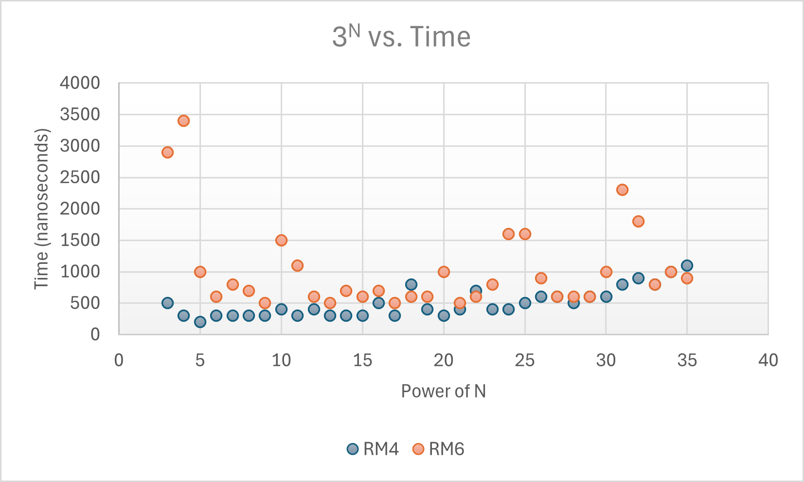
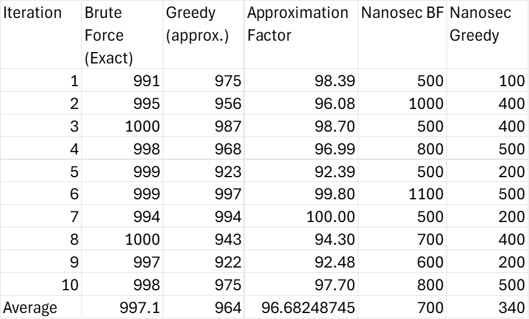

Project 1 Recursion
=======================

## Tower of Hanoi (25 points)

The largest number of disks for the Tower of Hanoi to be reasonably solved is around 30 disks.
Looking at both graphs, past 30 disks the graphs start growing exponentially, meaning that it will tak ea greater amount of steps and time to complete.
The legend is not accurate, if the munks are moving 1 disk per second, 35 disks is already 10 centuries and will rougly double per disk.
As well as the Earth has about 1 billion years left chaning those years into second, then using the equation to solve the tower in the minimal amount of moves will bring the end of the world around 54 disks.

## Powers of 3 (25 points)

The results are unexpected because the RM4 algorithm performed faster and more lineraly than the RM6 algorithm.
Thinking that the RM6 would be more efficient, because the function is able to reduce the number of multiplications required to run and switching with the property of exponents.
Had to look up why there were spikes in the RM6 function, found out some causes are from system factors like caching or contect switching.

## Subset Sum (75 points)

The approximation algorithm did pretty well, it was able to get within 10% of the exact algorithm, with one iteration matching.
On average there was a 96.7% accuracy between the exact algorithm and the approximation algorithm.
The approximation algorithm was quicker than the exact algorithm, on average the time for the approximation algorithm to finish is about half of the exact algorithm.
The approximation algorithm is worth using, since it was able to get very clode to the exact algorithm, but only if the quickest route is need. But not the best if accuracy is needed, though during these iterations were close to each other, it mainly depends on the numbers given.